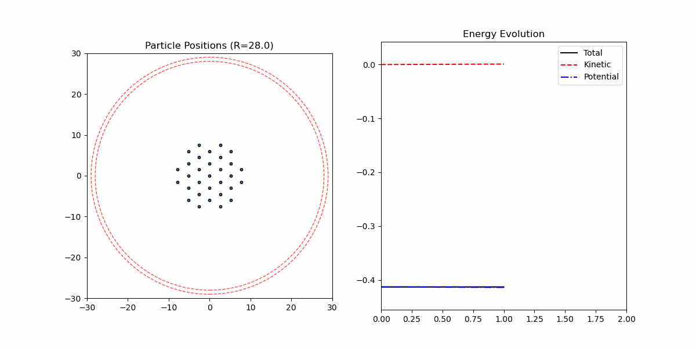

# Particle Simulation using C++ and pybind11

[English](README.md) | [中文](README_ZH.md)

## Project Overview

This is a C++-based particle simulation framework that supports various physical models, including:
- Overdamped Langevin Equation
- Nose-Hoover
- Nose-Hoover Langevin

The project utilizes modern C++ and pybind11 to implement an efficient computational core while providing Python interfaces for data visualization and analysis.

## Demonstrations

Here are some examples of particle simulations using different models:

### Langevin Dynamics


### Nose-Hoover Thermostat


## Project Structure

```
.
├── examples/             # C++ example programs
├── include/              # Header files
│   ├── Integrator.h      # Integrator base class and various integration methods
│   ├── IPS.h             # Interactive Particle System class
│   ├── OverdampedLangevin.h # Overdamped Langevin model
│   ├── Particles.h       # Particle system data structure
│   ├── Potential.h       # Potential function definitions
│   ├── utils.h           # Utility functions
│   └── vec.h             # Vector class definition
├── pybind/               # Python bindings
│   ├── IPSModule.cpp     # Interactive Particle System Python module
│   └── ODModule.cpp      # Langevin equation Python module
└── scripts/              # Python scripts and notebooks
    ├── DBSCAN/           # Density clustering related scripts
    ├── Cluster/          # Particle clustering related scripts
    ├── Deterministic_IPS/ # Deterministic IPS simulation
    ├── Deterministic_themostat/ # Deterministic thermostat simulation
    ├── Langvein_IPS/     # Langevin IPS related scripts
    ├── harmonic_oscillator/ # Harmonic oscillator simulation scripts
    ├── OL_draw.ipynb     # Overdamped Langevin trajectory visualization
    ├── utils.py          # Utility functions
    └── wrappers.py       # Python wrappers for C++ executables
```

## Technical Features

### 1. pybind11 Zero-Copy Data Transfer

This project implements efficient data exchange between C++ and Python using pybind11, with core features including:

- **Zero-Copy Data Transfer**: Using pointers and views to avoid copying large arrays
- **GIL Management**: Releases Python GIL for critical computation steps to enable parallel computing
- **Numpy Integration**: Direct conversion of C++ arrays to numpy arrays without copying

### 2. Simulation Models

The project supports various thermodynamic models and integrators:

- **Integrators**:
  - LeapFrog
  - ABOBA
  - Nose-Hoover
  - NoseHooverLangevin

- **Particle Systems**:
  - Standard Particle System
  - Langevin Particle System
  - Nose-Hoover Particle System
  - Nose-Hoover-Langevin Particle System

- **Potential Functions**:
  - Lennard-Jones Potential
  - Spring Potential
  - Harmonic Oscillator Constraint
  - Radial Constraint

## Usage

### Building the Project

```bash
cmake -B build -G Ninja -DUSE_PYBIND=ON
ninja -C build
```
