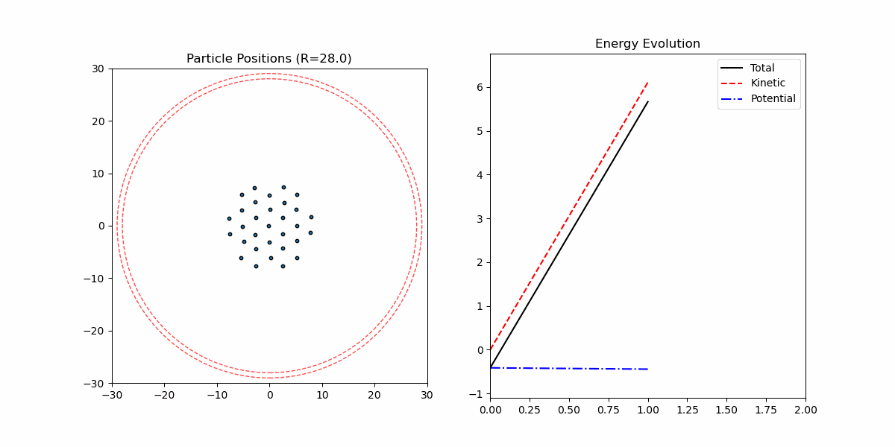
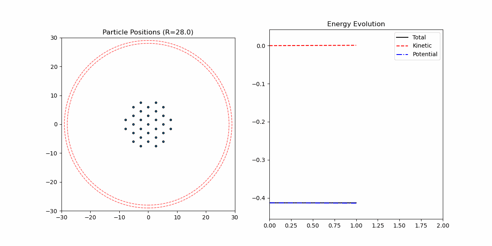

# 基于C++与pybind11的粒子模拟

[English](README.md) | [中文](README_ZH.md)

## 项目概述

这是一个基于C++的粒子模拟框架，支持多种物理模型，包括：
- 朗之万方程 (Overdamped Langevin)
- Nose-Hoover
- Nose-Hoover Langevin

该项目利用现代C++和pybind11实现了高效的计算核心，同时提供Python接口，便于数据可视化和分析。

## 演示效果

以下是使用不同模型的粒子模拟示例：

### 朗之万动力学


### Nose-Hoover热浴


## 项目结构

```
.
├── examples/             # C++示例程序
├── include/              # 头文件
│   ├── Integrator.h      # 积分器基类和各种积分方法
│   ├── IPS.h             # 交互粒子系统类
│   ├── OverdampedLangevin.h # 超阻尼朗之万模型
│   ├── Particles.h       # 粒子系统数据结构
│   ├── Potential.h       # 势能函数定义
│   ├── utils.h           # 工具函数
│   └── vec.h             # 向量类定义
├── pybind/               # Python绑定
│   ├── IPSModule.cpp     # 交互粒子系统Python模块
│   └── ODModule.cpp      # 朗之万方程Python模块
└── scripts/              # Python脚本和笔记本
    ├── DBSCAN/           # 密度聚类相关脚本
    ├── Cluster/          # 粒子聚类相关脚本
    ├── Deterministic_IPS/ # 确定性IPS模拟
    ├── Deterministic_themostat/ # 确定性热浴模拟
    ├── Langvein_IPS/     # 朗之万IPS相关脚本
    ├── harmonic_oscillator/ # 谐振子模拟脚本
    ├── OL_draw.ipynb     # 超阻尼朗之万轨迹可视化
    ├── utils.py          # 工具函数
    └── wrappers.py       # C++可执行文件的Python包装器
```

## 技术特点

### 1. pybind11零拷贝数据传输

本项目使用pybind11实现了C++和Python间的高效数据交换，核心特性包括：

- **零拷贝数据传输**：使用指针和视图避免大型数组的复制
- **GIL管理**：关键计算步骤会释放Python GIL以实现并行计算
- **Numpy集成**：C++数组直接转换为numpy数组而无需复制


### 2. 模拟模型

项目支持多种热力学模型和积分器：

- **积分器**：
  - LeapFrog
  - ABOBA
  - Nose-Hoover
  - NoseHooverLangevin

- **粒子系统**：
  - 标准粒子系统
  - 朗之万粒子系统
  - Nose-Hoover粒子系统
  - Nose-Hoover-Langevin粒子系统

- **势能函数**：
  - Lennard-Jones势
  - 弹簧势
  - 谐振子约束
  - 径向约束


## 使用方法

### 构建项目

```bash
cmake -B build -G Ninja -DUSE_PYBIND=ON
ninja -C build
```